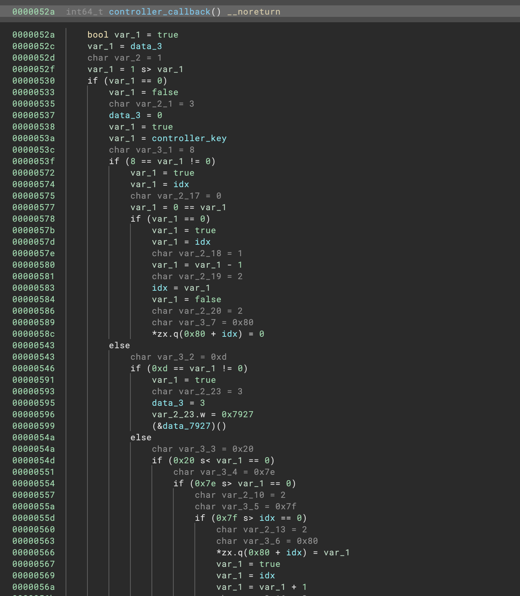
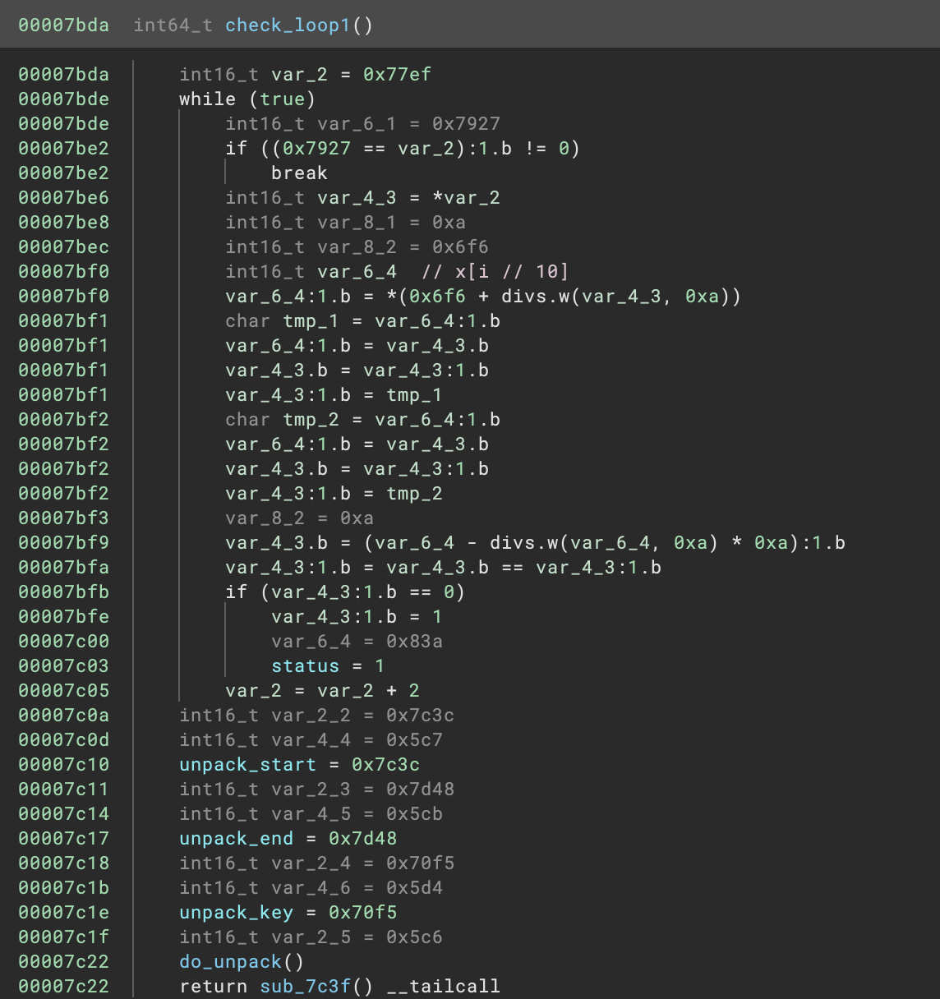
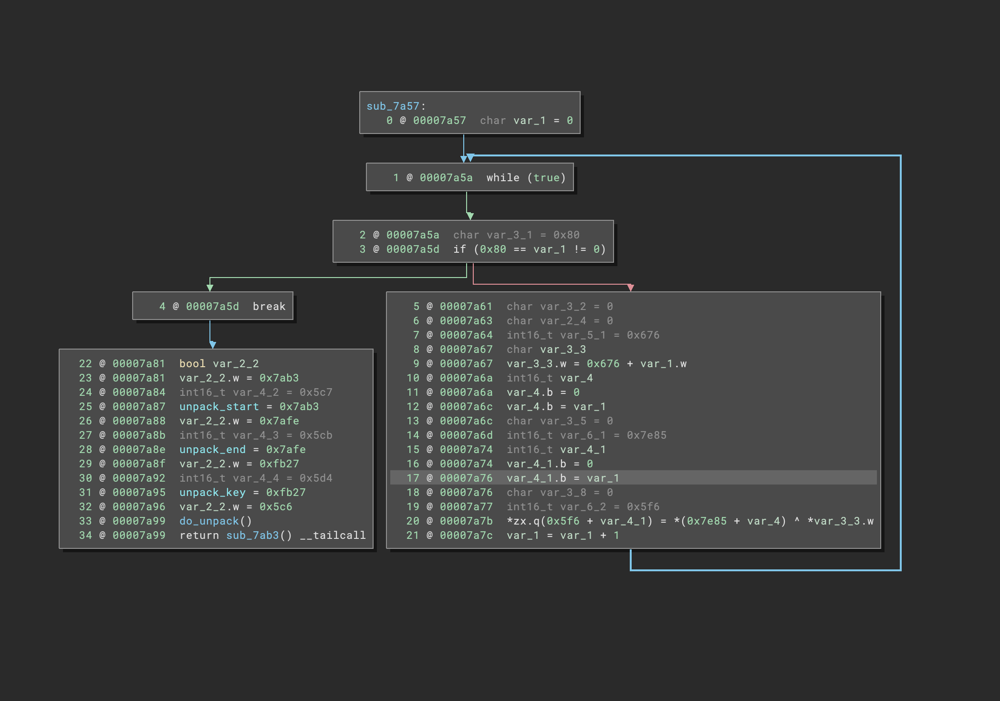

# bn-uxn

Binary Ninja plugin for [uxn](https://100r.co/site/uxn.html) varvara roms.

Developed during GoogleCTF 2023.

## Notes

- Most instructions implemented.
- Some instructions that operate on the return stack are not fully lifted.
- Calls to functions that change the stack cause a bit of stack offset confusion.

## Pictures

## Examples

- [auxin.rom](roms/auxin.rom) from GoogleCTF 2023. See more information about that challenge [here](https://github.com/google/google-ctf/tree/master/2023/rev-auxin)

- [piano.rom](roms/piano.rom) distributed with the [uxn emulator](https://sr.ht/~rabbits/uxn/)

You can also find more ROMS [here](https://100r.co/site/uxn.html)
